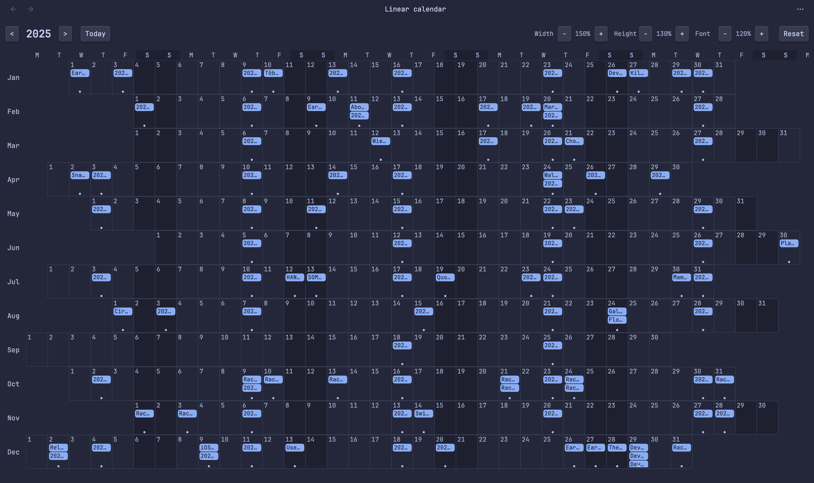

# Linear Calendar

A year-at-a-glance calendar view for [Obsidian](https://obsidian.md) with months displayed as rows and weekday-aligned columns.



## Features

- **Linear year view** - All 12 months displayed as horizontal rows
- **Weekday alignment** - Days are aligned by weekday across all months (Mondays under Mondays, etc.)
- **Multiple event sources**:
  - Daily notes (configurable folder and date format)
  - Frontmatter date fields (configurable)
  - File creation dates
- **Interactive**:
  - Click any day to open/create a daily note
  - Click an event to open that note
- **Customizable display**:
  - Independent width/height scaling
  - Adjustable font size
  - Configurable weekday and month labels
- **Visual highlights**:
  - Today marked with accent color
  - Weekend columns distinguished
  - Events shown as colored pills

## Installation

### From Community Plugins (recommended)

1. Open Obsidian Settings
2. Go to Community Plugins and disable Safe Mode
3. Click Browse and search for "Linear Calendar"
4. Install and enable the plugin

### Manual Installation

1. Download `main.js`, `manifest.json`, and `styles.css` from the [latest release](https://github.com/yourusername/obsidian-linear-calendar/releases/latest)
2. Create a folder called `linear-calendar` in your vault's `.obsidian/plugins/` directory
3. Copy the downloaded files into this folder
4. Reload Obsidian and enable the plugin in Settings > Community Plugins

## Usage

1. Click the calendar icon in the ribbon, or
2. Use the command palette: "Linear Calendar: Open linear calendar"

### Controls

- **Year navigation**: `<` and `>` buttons to change year, `Today` to jump to current year
- **Width**: Adjust cell width (horizontal scaling)
- **Height**: Adjust cell height (vertical scaling)
- **Font**: Adjust font size for day numbers and events
- **Reset**: Return to default sizes

### Settings

- **Daily notes folder**: Where your daily notes are stored
- **Daily note format**: Date format for daily note filenames (e.g., `YYYY-MM-DD`)
- **Date fields**: Frontmatter fields to check for dates (comma-separated)
- **Show file creation dates**: Display notes on their creation date
- **Weekday/Month labels**: Customize the labels
- **Default sizes**: Set default values for width, height, and font scale

## Development

```bash
# Install dependencies
npm install

# Build for development (with watch)
npm run dev

# Build for production
npm run build
```

## License

[MIT](LICENSE)

## Support

If you find this plugin useful, consider:
- Starring the repository on GitHub
- Reporting issues or suggesting features
- Contributing to the code
